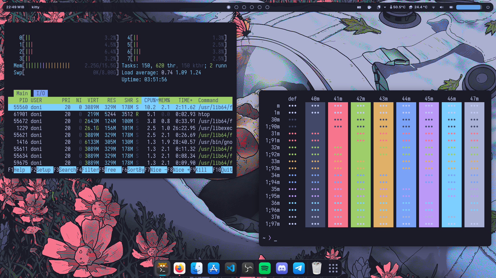
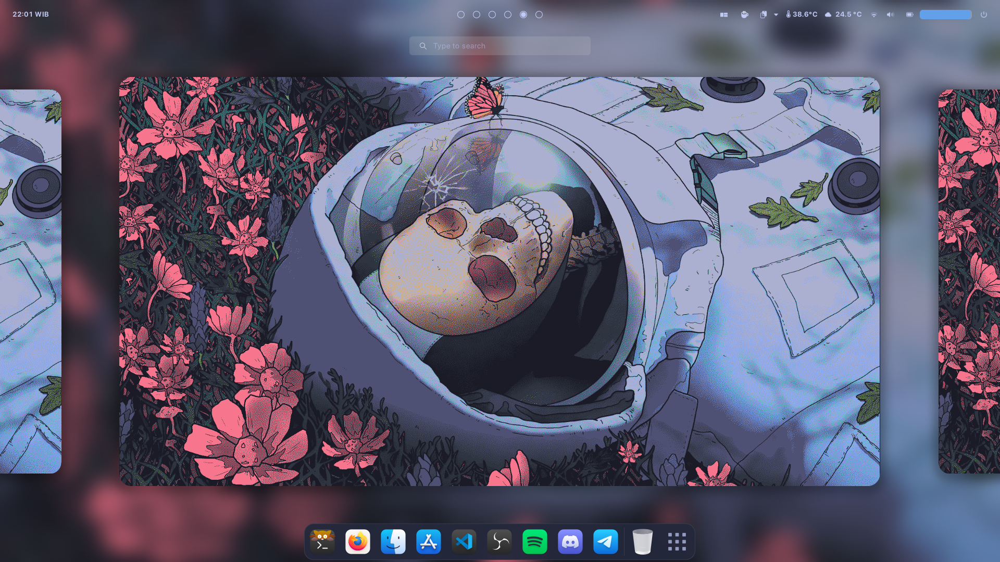
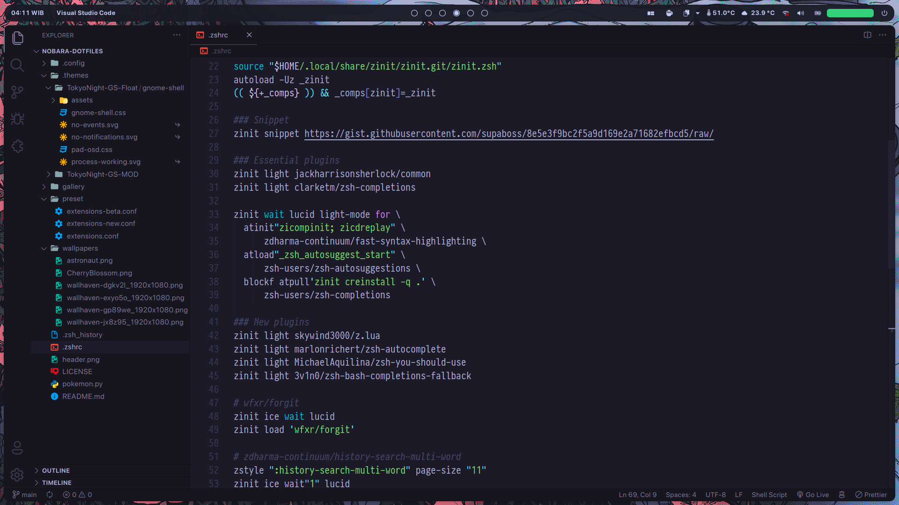

<p align="center">
  
</p>

<p align="center">
  
  
  
</p>

## 🌸 Gallery








## ℹ️ Important Notes

- The rice is done on GNOME v42.x and probably will not work on older version. Some of the extensions are comes pre-installed (*) from Nobara 36, which is the OS I use.
- Kindly check the [gallery](https://github.com/slashedzer0/nobara-dotfiles/tree/main/gallery) for more screenshots (including old ones).
- You can remove the titlebar buttons to achieve more minimalism:

```bash
# Don't forget to set some keyboard shortcuts before applying
gsettings set org.gnome.desktop.wm.preferences button-layout :
```

- To load extensions settings, install the extensions first then run:

```bash
# Assuming you are already in this dotfiles directory
cd preset
dconf load /org/gnome/shell/extensions/ < extensions-latest.conf
```

- The top panel is based on [Tokyo Night GTK](https://www.gnome-look.org/p/1681470). I simply modified some lines in `gnome-shell.css` for little improvements.
- I also modified the neofetch config from [neofetch-themes](https://github.com/chick2d/neofetch-themes/blob/main/normal/idlifetch.conf).

## 👾 Terminal Setup

- Emulator: [kitty](https://github.com/kovidgoyal/kitty)
- Shell: [zsh](https://github.com/zsh-users/zsh)
- Framework: [Zinit](https://github.com/zdharma-continuum/zinit)
- Prompt: [common](https://github.com/jackharrisonsherlock/common)

## 🎨 Desktop Setup

- Theme: [Tokyo Night GTK](https://github.com/Fausto-Korpsvart/Tokyo-Night-GTK-Theme) (dark/borderless)
- Icons: [WhiteSur](https://github.com/vinceliuice/WhiteSur-icon-theme) (bold)
- Fonts: [SF Pro Display](https://github.com/sahibjotsaggu/San-Francisco-Pro-Fonts), [Iosevka NF](https://github.com/ryanoasis/nerd-fonts/tree/master/patched-fonts/Iosevka)
- Cursor: [macOS Monterey](https://github.com/ful1e5/apple_cursor)

## 🧩 Extensions

- [User Themes](https://extensions.gnome.org/extension/19/user-themes/)
- [Dask to Dock](https://extensions.gnome.org/extension/307/dash-to-dock/)*
- [Blur my Shell](https://extensions.gnome.org/extension/3193/blur-my-shell/)*
- [Aylur’s Widgets](https://extensions.gnome.org/extension/5338/aylurs-widgets/)
- [Rounded Window Corners](https://extensions.gnome.org/extension/5237/rounded-window-corners/)
- [Just Perfection](https://extensions.gnome.org/extension/3843/just-perfection/)*
- [Pop Shell](https://github.com/pop-os/shell)*
- [Application Volume Mixer](https://extensions.gnome.org/extension/3499/application-volume-mixer/)*
- [Auto Move Windows](https://extensions.gnome.org/extension/16/auto-move-windows/)*
- [Media Controls](https://extensions.gnome.org/extension/4470/media-controls/)
- [Caffeine](https://extensions.gnome.org/extension/517/caffeine/)*
- [GSConnect](https://extensions.gnome.org/extension/1319/gsconnect/)*
- [OpenWeather](https://extensions.gnome.org/extension/750/openweather/)*
- [Gesture Improvements](https://extensions.gnome.org/extension/4245/gesture-improvements/)*
- [Clipboard History](https://extensions.gnome.org/extension/4839/clipboard-history/)*
- [Compiz alike magic lamp effect](https://extensions.gnome.org/extension/3740/compiz-alike-magic-lamp-effect/)
- [Vitals](https://extensions.gnome.org/extension/1460/vitals/)

## ⚡ Terminal Apps

- [neofetch](https://github.com/dylanaraps/neofetch) - fetch system info
- [cava](https://github.com/karlstav/cava) - audio visualizer
- [tty-clock](https://github.com/xorg62/tty-clock)
- [bottom](https://github.com/ClementTsang/bottom) / [htop](https://github.com/htop-dev/htop) - system monitor
- [pokemon-colorscripts](https://gitlab.com/phoneybadger/pokemon-colorscripts)
- [colorscript](https://gitlab.com/dwt1/shell-color-scripts)
- [tldr](https://github.com/tldr-pages/tldr) - your terminal companion
- [taskwarrior](https://github.com/GothenburgBitFactory/taskwarrior) - task management
- [yt-dlp](https://github.com/yt-dlp/yt-dlp) - youtube-dl but cooler

## 💫 Credits

- Fausto-Korpsvart
- Chick2D / IdliDev
- Gogh-Co
- Wallhaven

## 🍬 More…

- [Tokyo Night for VS Code](https://github.com/enkia/tokyo-night-vscode-theme)
- [Tokyo Night for SDDM](https://github.com/rototrash/tokyo-night-sddm)
- [Tokyo Night for BetterDiscord](https://github.com/Dyzean/Tokyo-Night)
- [Comfy for Spicetify](https://github.com/Comfy-Themes/Spicetify)
- [distro-grub-themes](https://github.com/AdisonCavani/distro-grub-themes)
- [r/startpages](https://www.reddit.com/r/startpages/)
- [ImageGoWild](https://ign.schrodinger-hat.it/color-schemes)
- [Gogh](https://github.com/Gogh-Co/Gogh)

---

<p align="center">
  
  [![forthebadge](data:image/svg+xml;base64,PHN2ZyB4bWxucz0iaHR0cDovL3d3dy53My5vcmcvMjAwMC9zdmciIHdpZHRoPSIyNDcuMTcwMDAwMDAwMDAwMDIiIGhlaWdodD0iMzUiIHZpZXdCb3g9IjAgMCAyNDcuMTcwMDAwMDAwMDAwMDIgMzUiPjxyZWN0IGNsYXNzPSJzdmdfX3JlY3QiIHg9IjAiIHk9IjAiIHdpZHRoPSIxMDguNjgiIGhlaWdodD0iMzUiIGZpbGw9IiNFRjQwNDEiLz48cmVjdCBjbGFzcz0ic3ZnX19yZWN0IiB4PSIxMDYuNjgiIHk9IjAiIHdpZHRoPSIxNDAuNDkiIGhlaWdodD0iMzUiIGZpbGw9IiNDMTI4MkQiLz48cGF0aCBjbGFzcz0ic3ZnX190ZXh0IiBkPSJNMTUuNjAgMjJMMTMuNjMgMTMuNDdMMTUuMTAgMTMuNDdMMTYuNDMgMTkuODhMMTguMDYgMTMuNDdMMTkuMzAgMTMuNDdMMjAuOTEgMTkuODlMMjIuMjIgMTMuNDdMMjMuNjkgMTMuNDdMMjEuNzIgMjJMMjAuMzEgMjJMMTguNjggMTUuNzdMMTcuMDIgMjJMMTUuNjAgMjJaTTI3LjQ5IDE4LjAwTDI3LjQ5IDE4LjAwTDI3LjQ5IDE3LjUyUTI3LjQ5IDE2LjI4IDI3Ljk0IDE1LjMyUTI4LjM4IDE0LjM3IDI5LjE4IDEzLjg2UTI5Ljk5IDEzLjM1IDMxLjAzIDEzLjM1UTMyLjA4IDEzLjM1IDMyLjg4IDEzLjg1UTMzLjY5IDE0LjM1IDM0LjEzIDE1LjI5UTM0LjU3IDE2LjIzIDM0LjU3IDE3LjQ4TDM0LjU3IDE3LjQ4TDM0LjU3IDE3Ljk2UTM0LjU3IDE5LjIxIDM0LjE0IDIwLjE2UTMzLjcxIDIxLjEwIDMyLjkwIDIxLjYxUTMyLjA5IDIyLjEyIDMxLjA1IDIyLjEyTDMxLjA1IDIyLjEyUTMwLjAxIDIyLjEyIDI5LjIwIDIxLjYxUTI4LjM5IDIxLjEwIDI3Ljk0IDIwLjE3UTI3LjUwIDE5LjIzIDI3LjQ5IDE4LjAwWk0yOC45OCAxNy40NkwyOC45OCAxNy45NlEyOC45OCAxOS4zNiAyOS41MiAyMC4xM1EzMC4wNyAyMC45MCAzMS4wNSAyMC45MEwzMS4wNSAyMC45MFEzMi4wMyAyMC45MCAzMi41NiAyMC4xNVEzMy4wOSAxOS40MCAzMy4wOSAxNy45NkwzMy4wOSAxNy45NkwzMy4wOSAxNy41MVEzMy4wOSAxNi4wOSAzMi41NSAxNS4zNFEzMi4wMiAxNC41OCAzMS4wMyAxNC41OEwzMS4wMyAxNC41OFEzMC4wNyAxNC41OCAyOS41MyAxNS4zM1EyOC45OSAxNi4wOSAyOC45OCAxNy40NkwyOC45OCAxNy40NlpNNDAuNTIgMjJMMzkuMDQgMjJMMzkuMDQgMTMuNDdMNDIuMDQgMTMuNDdRNDMuNTEgMTMuNDcgNDQuMzIgMTQuMTNRNDUuMTIgMTQuNzkgNDUuMTIgMTYuMDVMNDUuMTIgMTYuMDVRNDUuMTIgMTYuOTAgNDQuNzEgMTcuNDhRNDQuMjkgMTguMDYgNDMuNTYgMTguMzdMNDMuNTYgMTguMzdMNDUuNDcgMjEuOTJMNDUuNDcgMjJMNDMuODggMjJMNDIuMTcgMTguNzFMNDAuNTIgMTguNzFMNDAuNTIgMjJaTTQwLjUyIDE0LjY2TDQwLjUyIDE3LjUyTDQyLjA0IDE3LjUyUTQyLjc5IDE3LjUyIDQzLjIyIDE3LjE1UTQzLjY0IDE2Ljc3IDQzLjY0IDE2LjExTDQzLjY0IDE2LjExUTQzLjY0IDE1LjQzIDQzLjI1IDE1LjA1UTQyLjg2IDE0LjY4IDQyLjA4IDE0LjY2TDQyLjA4IDE0LjY2TDQwLjUyIDE0LjY2Wk01MS4wMCAyMkw0OS41MSAyMkw0OS41MSAxMy40N0w1MS4wMCAxMy40N0w1MS4wMCAxNy40N0w1MS44MiAxNi40Nkw1NC4zMSAxMy40N0w1Ni4xMSAxMy40N0w1Mi45NCAxNy4yNUw1Ni4yOSAyMkw1NC41MyAyMkw1MS45NiAxOC4zMUw1MS4wMCAxOS4zNEw1MS4wMCAyMlpNNTkuNjMgMTkuNDJMNTkuNjMgMTkuNDJMNjEuMTIgMTkuNDJRNjEuMTIgMjAuMTUgNjEuNjAgMjAuNTVRNjIuMDggMjAuOTUgNjIuOTcgMjAuOTVMNjIuOTcgMjAuOTVRNjMuNzUgMjAuOTUgNjQuMTQgMjAuNjNRNjQuNTMgMjAuMzIgNjQuNTMgMTkuODBMNjQuNTMgMTkuODBRNjQuNTMgMTkuMjQgNjQuMTMgMTguOTRRNjMuNzMgMTguNjMgNjIuNzAgMTguMzJRNjEuNjcgMTguMDEgNjEuMDYgMTcuNjNMNjEuMDYgMTcuNjNRNTkuOTAgMTYuOTAgNTkuOTAgMTUuNzJMNTkuOTAgMTUuNzJRNTkuOTAgMTQuNjkgNjAuNzQgMTQuMDJRNjEuNTggMTMuMzUgNjIuOTIgMTMuMzVMNjIuOTIgMTMuMzVRNjMuODEgMTMuMzUgNjQuNTEgMTMuNjhRNjUuMjEgMTQuMDEgNjUuNjAgMTQuNjFRNjYuMDAgMTUuMjIgNjYuMDAgMTUuOTZMNjYuMDAgMTUuOTZMNjQuNTMgMTUuOTZRNjQuNTMgMTUuMjkgNjQuMTEgMTQuOTFRNjMuNjkgMTQuNTQgNjIuOTEgMTQuNTRMNjIuOTEgMTQuNTRRNjIuMTggMTQuNTQgNjEuNzggMTQuODVRNjEuMzggMTUuMTYgNjEuMzggMTUuNzFMNjEuMzggMTUuNzFRNjEuMzggMTYuMTggNjEuODEgMTYuNTBRNjIuMjUgMTYuODEgNjMuMjQgMTcuMTBRNjQuMjQgMTcuNDAgNjQuODQgMTcuNzhRNjUuNDUgMTguMTYgNjUuNzMgMTguNjVRNjYuMDEgMTkuMTMgNjYuMDEgMTkuNzlMNjYuMDEgMTkuNzlRNjYuMDEgMjAuODYgNjUuMTkgMjEuNDlRNjQuMzcgMjIuMTIgNjIuOTcgMjIuMTJMNjIuOTcgMjIuMTJRNjIuMDUgMjIuMTIgNjEuMjcgMjEuNzdRNjAuNDkgMjEuNDMgNjAuMDYgMjAuODNRNTkuNjMgMjAuMjIgNTkuNjMgMTkuNDJaTTc2LjAwIDE4LjAwTDc2LjAwIDE4LjAwTDc2LjAwIDE3LjUyUTc2LjAwIDE2LjI4IDc2LjQ1IDE1LjMyUTc2Ljg5IDE0LjM3IDc3LjY5IDEzLjg2UTc4LjUwIDEzLjM1IDc5LjU0IDEzLjM1UTgwLjU5IDEzLjM1IDgxLjM5IDEzLjg1UTgyLjIwIDE0LjM1IDgyLjY0IDE1LjI5UTgzLjA4IDE2LjIzIDgzLjA4IDE3LjQ4TDgzLjA4IDE3LjQ4TDgzLjA4IDE3Ljk2UTgzLjA4IDE5LjIxIDgyLjY1IDIwLjE2UTgyLjIyIDIxLjEwIDgxLjQxIDIxLjYxUTgwLjYwIDIyLjEyIDc5LjU2IDIyLjEyTDc5LjU2IDIyLjEyUTc4LjUyIDIyLjEyIDc3LjcxIDIxLjYxUTc2Ljg5IDIxLjEwIDc2LjQ1IDIwLjE3UTc2LjAxIDE5LjIzIDc2LjAwIDE4LjAwWk03Ny40OSAxNy40Nkw3Ny40OSAxNy45NlE3Ny40OSAxOS4zNiA3OC4wMyAyMC4xM1E3OC41OCAyMC45MCA3OS41NiAyMC45MEw3OS41NiAyMC45MFE4MC41NCAyMC45MCA4MS4wNyAyMC4xNVE4MS42MCAxOS40MCA4MS42MCAxNy45Nkw4MS42MCAxNy45Nkw4MS42MCAxNy41MVE4MS42MCAxNi4wOSA4MS4wNiAxNS4zNFE4MC41MyAxNC41OCA3OS41NCAxNC41OEw3OS41NCAxNC41OFE3OC41OCAxNC41OCA3OC4wNCAxNS4zM1E3Ny41MCAxNi4wOSA3Ny40OSAxNy40Nkw3Ny40OSAxNy40NlpNODkuMDMgMjJMODcuNTUgMjJMODcuNTUgMTMuNDdMODkuMDMgMTMuNDdMOTIuODQgMTkuNTRMOTIuODQgMTMuNDdMOTQuMzEgMTMuNDdMOTQuMzEgMjJMOTIuODMgMjJMODkuMDMgMTUuOTVMODkuMDMgMjJaIiBmaWxsPSIjRkZGRkZGIi8+PHBhdGggY2xhc3M9InN2Z19fdGV4dCIgZD0iTTEyMy4wNyAyMkwxMjAuODcgMjJMMTIwLjg3IDEzLjYwTDEyMi44MiAxMy42MEwxMjUuNzggMTguNDVMMTI4LjY2IDEzLjYwTDEzMC42MSAxMy42MEwxMzAuNjQgMjJMMTI4LjQ2IDIyTDEyOC40MyAxNy41NUwxMjYuMjcgMjEuMTdMMTI1LjIyIDIxLjE3TDEyMy4wNyAxNy42N0wxMjMuMDcgMjJaTTEzNy45MiAxOC45NUwxMzQuNzIgMTMuNjBMMTM3LjIzIDEzLjYwTDEzOS4yMiAxNi45NEwxNDEuMjEgMTMuNjBMMTQzLjUxIDEzLjYwTDE0MC4zMCAxOC45OUwxNDAuMzAgMjJMMTM3LjkyIDIyTDEzNy45MiAxOC45NVpNMTU2Ljc3IDIyTDE1NC41NyAyMkwxNTQuNTcgMTMuNjBMMTU2LjUzIDEzLjYwTDE1OS40OCAxOC40NUwxNjIuMzYgMTMuNjBMMTY0LjMyIDEzLjYwTDE2NC4zNCAyMkwxNjIuMTYgMjJMMTYyLjE0IDE3LjU1TDE1OS45NyAyMS4xN0wxNTguOTIgMjEuMTdMMTU2Ljc3IDE3LjY3TDE1Ni43NyAyMlpNMTcwLjkyIDIyTDE2OC40OSAyMkwxNzIuMjAgMTMuNjBMMTc0LjU1IDEzLjYwTDE3OC4yNiAyMkwxNzUuNzkgMjJMMTc1LjEzIDIwLjM3TDE3MS41OCAyMC4zN0wxNzAuOTIgMjJaTTE3My4zNiAxNS45M0wxNzIuMjcgMTguNjFMMTc0LjQzIDE4LjYxTDE3My4zNiAxNS45M1pNMTgxLjk5IDE3LjgwTDE4MS45OSAxNy44MFExODEuOTkgMTYuNTQgMTgyLjU4IDE1LjU0UTE4My4xOCAxNC41NSAxODQuMjMgMTMuOTlRMTg1LjI5IDEzLjQzIDE4Ni42MCAxMy40M0wxODYuNjAgMTMuNDNRMTg3Ljc2IDEzLjQzIDE4OC42OCAxMy44NFExODkuNjAgMTQuMjUgMTkwLjIyIDE1LjAyTDE5MC4yMiAxNS4wMkwxODguNzEgMTYuMzlRMTg3Ljg5IDE1LjQwIDE4Ni43MyAxNS40MEwxODYuNzMgMTUuNDBRMTg2LjA0IDE1LjQwIDE4NS41MSAxNS43MFExODQuOTggMTYgMTg0LjY4IDE2LjU0UTE4NC4zOCAxNy4wOSAxODQuMzggMTcuODBMMTg0LjM4IDE3LjgwUTE4NC4zOCAxOC41MSAxODQuNjggMTkuMDVRMTg0Ljk4IDE5LjYwIDE4NS41MSAxOS45MFExODYuMDQgMjAuMjAgMTg2LjczIDIwLjIwTDE4Ni43MyAyMC4yMFExODcuODkgMjAuMjAgMTg4LjcxIDE5LjIyTDE4OC43MSAxOS4yMkwxOTAuMjIgMjAuNThRMTg5LjYxIDIxLjM1IDE4OC42OCAyMS43NlExODcuNzYgMjIuMTcgMTg2LjYwIDIyLjE3TDE4Ni42MCAyMi4xN1ExODUuMjkgMjIuMTcgMTg0LjIzIDIxLjYxUTE4My4xOCAyMS4wNSAxODIuNTggMjAuMDVRMTgxLjk5IDE5LjA2IDE4MS45OSAxNy44MFpNMTk3LjEzIDIyTDE5NC43NSAyMkwxOTQuNzUgMTMuNjBMMTk3LjEzIDEzLjYwTDE5Ny4xMyAxNi43NkwyMDAuMzcgMTYuNzZMMjAwLjM3IDEzLjYwTDIwMi43NSAxMy42MEwyMDIuNzUgMjJMMjAwLjM3IDIyTDIwMC4zNyAxOC43MkwxOTcuMTMgMTguNzJMMTk3LjEzIDIyWk0yMTAuMjkgMjJMMjA3LjkxIDIyTDIwNy45MSAxMy42MEwyMTAuMjkgMTMuNjBMMjEwLjI5IDIyWk0yMTcuNzkgMjJMMjE1LjQ2IDIyTDIxNS40NiAxMy42MEwyMTcuNDIgMTMuNjBMMjIxLjEzIDE4LjA3TDIyMS4xMyAxMy42MEwyMjMuNDUgMTMuNjBMMjIzLjQ1IDIyTDIyMS41MCAyMkwyMTcuNzkgMTcuNTJMMjE3Ljc5IDIyWk0yMzUuMzYgMjJMMjI4LjYyIDIyTDIyOC42MiAxMy42MEwyMzUuMjEgMTMuNjBMMjM1LjIxIDE1LjQ0TDIzMC45NyAxNS40NEwyMzAuOTcgMTYuODVMMjM0LjcwIDE2Ljg1TDIzNC43MCAxOC42M0wyMzAuOTcgMTguNjNMMjMwLjk3IDIwLjE3TDIzNS4zNiAyMC4xN0wyMzUuMzYgMjJaIiBmaWxsPSIjRkZGRkZGIiB4PSIxMTkuNjgiLz48L3N2Zz4=)](https://forthebadge.com)[![forthebadge](data:image/svg+xml;base64,PHN2ZyB4bWxucz0iaHR0cDovL3d3dy53My5vcmcvMjAwMC9zdmciIHdpZHRoPSIyNDcuMTcwMDAwMDAwMDAwMDIiIGhlaWdodD0iMzUiIHZpZXdCb3g9IjAgMCAyNDcuMTcwMDAwMDAwMDAwMDIgMzUiPjxyZWN0IGNsYXNzPSJzdmdfX3JlY3QiIHg9IjAiIHk9IjAiIHdpZHRoPSIxMDguNjgiIGhlaWdodD0iMzUiIGZpbGw9IiNFRjQwNDEiLz48cmVjdCBjbGFzcz0ic3ZnX19yZWN0IiB4PSIxMDYuNjgiIHk9IjAiIHdpZHRoPSIxNDAuNDkiIGhlaWdodD0iMzUiIGZpbGw9IiNDMTI4MkQiLz48cGF0aCBjbGFzcz0ic3ZnX190ZXh0IiBkPSJNMTUuNjAgMjJMMTMuNjMgMTMuNDdMMTUuMTAgMTMuNDdMMTYuNDMgMTkuODhMMTguMDYgMTMuNDdMMTkuMzAgMTMuNDdMMjAuOTEgMTkuODlMMjIuMjIgMTMuNDdMMjMuNjkgMTMuNDdMMjEuNzIgMjJMMjAuMzEgMjJMMTguNjggMTUuNzdMMTcuMDIgMjJMMTUuNjAgMjJaTTI3LjQ5IDE4LjAwTDI3LjQ5IDE4LjAwTDI3LjQ5IDE3LjUyUTI3LjQ5IDE2LjI4IDI3Ljk0IDE1LjMyUTI4LjM4IDE0LjM3IDI5LjE4IDEzLjg2UTI5Ljk5IDEzLjM1IDMxLjAzIDEzLjM1UTMyLjA4IDEzLjM1IDMyLjg4IDEzLjg1UTMzLjY5IDE0LjM1IDM0LjEzIDE1LjI5UTM0LjU3IDE2LjIzIDM0LjU3IDE3LjQ4TDM0LjU3IDE3LjQ4TDM0LjU3IDE3Ljk2UTM0LjU3IDE5LjIxIDM0LjE0IDIwLjE2UTMzLjcxIDIxLjEwIDMyLjkwIDIxLjYxUTMyLjA5IDIyLjEyIDMxLjA1IDIyLjEyTDMxLjA1IDIyLjEyUTMwLjAxIDIyLjEyIDI5LjIwIDIxLjYxUTI4LjM5IDIxLjEwIDI3Ljk0IDIwLjE3UTI3LjUwIDE5LjIzIDI3LjQ5IDE4LjAwWk0yOC45OCAxNy40NkwyOC45OCAxNy45NlEyOC45OCAxOS4zNiAyOS41MiAyMC4xM1EzMC4wNyAyMC45MCAzMS4wNSAyMC45MEwzMS4wNSAyMC45MFEzMi4wMyAyMC45MCAzMi41NiAyMC4xNVEzMy4wOSAxOS40MCAzMy4wOSAxNy45NkwzMy4wOSAxNy45NkwzMy4wOSAxNy41MVEzMy4wOSAxNi4wOSAzMi41NSAxNS4zNFEzMi4wMiAxNC41OCAzMS4wMyAxNC41OEwzMS4wMyAxNC41OFEzMC4wNyAxNC41OCAyOS41MyAxNS4zM1EyOC45OSAxNi4wOSAyOC45OCAxNy40NkwyOC45OCAxNy40NlpNNDAuNTIgMjJMMzkuMDQgMjJMMzkuMDQgMTMuNDdMNDIuMDQgMTMuNDdRNDMuNTEgMTMuNDcgNDQuMzIgMTQuMTNRNDUuMTIgMTQuNzkgNDUuMTIgMTYuMDVMNDUuMTIgMTYuMDVRNDUuMTIgMTYuOTAgNDQuNzEgMTcuNDhRNDQuMjkgMTguMDYgNDMuNTYgMTguMzdMNDMuNTYgMTguMzdMNDUuNDcgMjEuOTJMNDUuNDcgMjJMNDMuODggMjJMNDIuMTcgMTguNzFMNDAuNTIgMTguNzFMNDAuNTIgMjJaTTQwLjUyIDE0LjY2TDQwLjUyIDE3LjUyTDQyLjA0IDE3LjUyUTQyLjc5IDE3LjUyIDQzLjIyIDE3LjE1UTQzLjY0IDE2Ljc3IDQzLjY0IDE2LjExTDQzLjY0IDE2LjExUTQzLjY0IDE1LjQzIDQzLjI1IDE1LjA1UTQyLjg2IDE0LjY4IDQyLjA4IDE0LjY2TDQyLjA4IDE0LjY2TDQwLjUyIDE0LjY2Wk01MS4wMCAyMkw0OS41MSAyMkw0OS41MSAxMy40N0w1MS4wMCAxMy40N0w1MS4wMCAxNy40N0w1MS44MiAxNi40Nkw1NC4zMSAxMy40N0w1Ni4xMSAxMy40N0w1Mi45NCAxNy4yNUw1Ni4yOSAyMkw1NC41MyAyMkw1MS45NiAxOC4zMUw1MS4wMCAxOS4zNEw1MS4wMCAyMlpNNTkuNjMgMTkuNDJMNTkuNjMgMTkuNDJMNjEuMTIgMTkuNDJRNjEuMTIgMjAuMTUgNjEuNjAgMjAuNTVRNjIuMDggMjAuOTUgNjIuOTcgMjAuOTVMNjIuOTcgMjAuOTVRNjMuNzUgMjAuOTUgNjQuMTQgMjAuNjNRNjQuNTMgMjAuMzIgNjQuNTMgMTkuODBMNjQuNTMgMTkuODBRNjQuNTMgMTkuMjQgNjQuMTMgMTguOTRRNjMuNzMgMTguNjMgNjIuNzAgMTguMzJRNjEuNjcgMTguMDEgNjEuMDYgMTcuNjNMNjEuMDYgMTcuNjNRNTkuOTAgMTYuOTAgNTkuOTAgMTUuNzJMNTkuOTAgMTUuNzJRNTkuOTAgMTQuNjkgNjAuNzQgMTQuMDJRNjEuNTggMTMuMzUgNjIuOTIgMTMuMzVMNjIuOTIgMTMuMzVRNjMuODEgMTMuMzUgNjQuNTEgMTMuNjhRNjUuMjEgMTQuMDEgNjUuNjAgMTQuNjFRNjYuMDAgMTUuMjIgNjYuMDAgMTUuOTZMNjYuMDAgMTUuOTZMNjQuNTMgMTUuOTZRNjQuNTMgMTUuMjkgNjQuMTEgMTQuOTFRNjMuNjkgMTQuNTQgNjIuOTEgMTQuNTRMNjIuOTEgMTQuNTRRNjIuMTggMTQuNTQgNjEuNzggMTQuODVRNjEuMzggMTUuMTYgNjEuMzggMTUuNzFMNjEuMzggMTUuNzFRNjEuMzggMTYuMTggNjEuODEgMTYuNTBRNjIuMjUgMTYuODEgNjMuMjQgMTcuMTBRNjQuMjQgMTcuNDAgNjQuODQgMTcuNzhRNjUuNDUgMTguMTYgNjUuNzMgMTguNjVRNjYuMDEgMTkuMTMgNjYuMDEgMTkuNzlMNjYuMDEgMTkuNzlRNjYuMDEgMjAuODYgNjUuMTkgMjEuNDlRNjQuMzcgMjIuMTIgNjIuOTcgMjIuMTJMNjIuOTcgMjIuMTJRNjIuMDUgMjIuMTIgNjEuMjcgMjEuNzdRNjAuNDkgMjEuNDMgNjAuMDYgMjAuODNRNTkuNjMgMjAuMjIgNTkuNjMgMTkuNDJaTTc2LjAwIDE4LjAwTDc2LjAwIDE4LjAwTDc2LjAwIDE3LjUyUTc2LjAwIDE2LjI4IDc2LjQ1IDE1LjMyUTc2Ljg5IDE0LjM3IDc3LjY5IDEzLjg2UTc4LjUwIDEzLjM1IDc5LjU0IDEzLjM1UTgwLjU5IDEzLjM1IDgxLjM5IDEzLjg1UTgyLjIwIDE0LjM1IDgyLjY0IDE1LjI5UTgzLjA4IDE2LjIzIDgzLjA4IDE3LjQ4TDgzLjA4IDE3LjQ4TDgzLjA4IDE3Ljk2UTgzLjA4IDE5LjIxIDgyLjY1IDIwLjE2UTgyLjIyIDIxLjEwIDgxLjQxIDIxLjYxUTgwLjYwIDIyLjEyIDc5LjU2IDIyLjEyTDc5LjU2IDIyLjEyUTc4LjUyIDIyLjEyIDc3LjcxIDIxLjYxUTc2Ljg5IDIxLjEwIDc2LjQ1IDIwLjE3UTc2LjAxIDE5LjIzIDc2LjAwIDE4LjAwWk03Ny40OSAxNy40Nkw3Ny40OSAxNy45NlE3Ny40OSAxOS4zNiA3OC4wMyAyMC4xM1E3OC41OCAyMC45MCA3OS41NiAyMC45MEw3OS41NiAyMC45MFE4MC41NCAyMC45MCA4MS4wNyAyMC4xNVE4MS42MCAxOS40MCA4MS42MCAxNy45Nkw4MS42MCAxNy45Nkw4MS42MCAxNy41MVE4MS42MCAxNi4wOSA4MS4wNiAxNS4zNFE4MC41MyAxNC41OCA3OS41NCAxNC41OEw3OS41NCAxNC41OFE3OC41OCAxNC41OCA3OC4wNCAxNS4zM1E3Ny41MCAxNi4wOSA3Ny40OSAxNy40Nkw3Ny40OSAxNy40NlpNODkuMDMgMjJMODcuNTUgMjJMODcuNTUgMTMuNDdMODkuMDMgMTMuNDdMOTIuODQgMTkuNTRMOTIuODQgMTMuNDdMOTQuMzEgMTMuNDdMOTQuMzEgMjJMOTIuODMgMjJMODkuMDMgMTUuOTVMODkuMDMgMjJaIiBmaWxsPSIjRkZGRkZGIi8+PHBhdGggY2xhc3M9InN2Z19fdGV4dCIgZD0iTTEyMy4wNyAyMkwxMjAuODcgMjJMMTIwLjg3IDEzLjYwTDEyMi44MiAxMy42MEwxMjUuNzggMTguNDVMMTI4LjY2IDEzLjYwTDEzMC42MSAxMy42MEwxMzAuNjQgMjJMMTI4LjQ2IDIyTDEyOC40MyAxNy41NUwxMjYuMjcgMjEuMTdMMTI1LjIyIDIxLjE3TDEyMy4wNyAxNy42N0wxMjMuMDcgMjJaTTEzNy45MiAxOC45NUwxMzQuNzIgMTMuNjBMMTM3LjIzIDEzLjYwTDEzOS4yMiAxNi45NEwxNDEuMjEgMTMuNjBMMTQzLjUxIDEzLjYwTDE0MC4zMCAxOC45OUwxNDAuMzAgMjJMMTM3LjkyIDIyTDEzNy45MiAxOC45NVpNMTU2Ljc3IDIyTDE1NC41NyAyMkwxNTQuNTcgMTMuNjBMMTU2LjUzIDEzLjYwTDE1OS40OCAxOC40NUwxNjIuMzYgMTMuNjBMMTY0LjMyIDEzLjYwTDE2NC4zNCAyMkwxNjIuMTYgMjJMMTYyLjE0IDE3LjU1TDE1OS45NyAyMS4xN0wxNTguOTIgMjEuMTdMMTU2Ljc3IDE3LjY3TDE1Ni43NyAyMlpNMTcwLjkyIDIyTDE2OC40OSAyMkwxNzIuMjAgMTMuNjBMMTc0LjU1IDEzLjYwTDE3OC4yNiAyMkwxNzUuNzkgMjJMMTc1LjEzIDIwLjM3TDE3MS41OCAyMC4zN0wxNzAuOTIgMjJaTTE3My4zNiAxNS45M0wxNzIuMjcgMTguNjFMMTc0LjQzIDE4LjYxTDE3My4zNiAxNS45M1pNMTgxLjk5IDE3LjgwTDE4MS45OSAxNy44MFExODEuOTkgMTYuNTQgMTgyLjU4IDE1LjU0UTE4My4xOCAxNC41NSAxODQuMjMgMTMuOTlRMTg1LjI5IDEzLjQzIDE4Ni42MCAxMy40M0wxODYuNjAgMTMuNDNRMTg3Ljc2IDEzLjQzIDE4OC42OCAxMy44NFExODkuNjAgMTQuMjUgMTkwLjIyIDE1LjAyTDE5MC4yMiAxNS4wMkwxODguNzEgMTYuMzlRMTg3Ljg5IDE1LjQwIDE4Ni43MyAxNS40MEwxODYuNzMgMTUuNDBRMTg2LjA0IDE1LjQwIDE4NS41MSAxNS43MFExODQuOTggMTYgMTg0LjY4IDE2LjU0UTE4NC4zOCAxNy4wOSAxODQuMzggMTcuODBMMTg0LjM4IDE3LjgwUTE4NC4zOCAxOC41MSAxODQuNjggMTkuMDVRMTg0Ljk4IDE5LjYwIDE4NS41MSAxOS45MFExODYuMDQgMjAuMjAgMTg2LjczIDIwLjIwTDE4Ni43MyAyMC4yMFExODcuODkgMjAuMjAgMTg4LjcxIDE5LjIyTDE4OC43MSAxOS4yMkwxOTAuMjIgMjAuNThRMTg5LjYxIDIxLjM1IDE4OC42OCAyMS43NlExODcuNzYgMjIuMTcgMTg2LjYwIDIyLjE3TDE4Ni42MCAyMi4xN1ExODUuMjkgMjIuMTcgMTg0LjIzIDIxLjYxUTE4My4xOCAyMS4wNSAxODIuNTggMjAuMDVRMTgxLjk5IDE5LjA2IDE4MS45OSAxNy44MFpNMTk3LjEzIDIyTDE5NC43NSAyMkwxOTQuNzUgMTMuNjBMMTk3LjEzIDEzLjYwTDE5Ny4xMyAxNi43NkwyMDAuMzcgMTYuNzZMMjAwLjM3IDEzLjYwTDIwMi43NSAxMy42MEwyMDIuNzUgMjJMMjAwLjM3IDIyTDIwMC4zNyAxOC43MkwxOTcuMTMgMTguNzJMMTk3LjEzIDIyWk0yMTAuMjkgMjJMMjA3LjkxIDIyTDIwNy45MSAxMy42MEwyMTAuMjkgMTMuNjBMMjEwLjI5IDIyWk0yMTcuNzkgMjJMMjE1LjQ2IDIyTDIxNS40NiAxMy42MEwyMTcuNDIgMTMuNjBMMjIxLjEzIDE4LjA3TDIyMS4xMyAxMy42MEwyMjMuNDUgMTMuNjBMMjIzLjQ1IDIyTDIyMS41MCAyMkwyMTcuNzkgMTcuNTJMMjE3Ljc5IDIyWk0yMzUuMzYgMjJMMjI4LjYyIDIyTDIyOC42MiAxMy42MEwyMzUuMjEgMTMuNjBMMjM1LjIxIDE1LjQ0TDIzMC45NyAxNS40NEwyMzAuOTcgMTYuODVMMjM0LjcwIDE2Ljg1TDIzNC43MCAxOC42M0wyMzAuOTcgMTguNjNMMjMwLjk3IDIwLjE3TDIzNS4zNiAyMC4xN0wyMzUuMzYgMjJaIiBmaWxsPSIjRkZGRkZGIiB4PSIxMTkuNjgiLz48L3N2Zz4=)](https://forthebadge.com)
</p>
