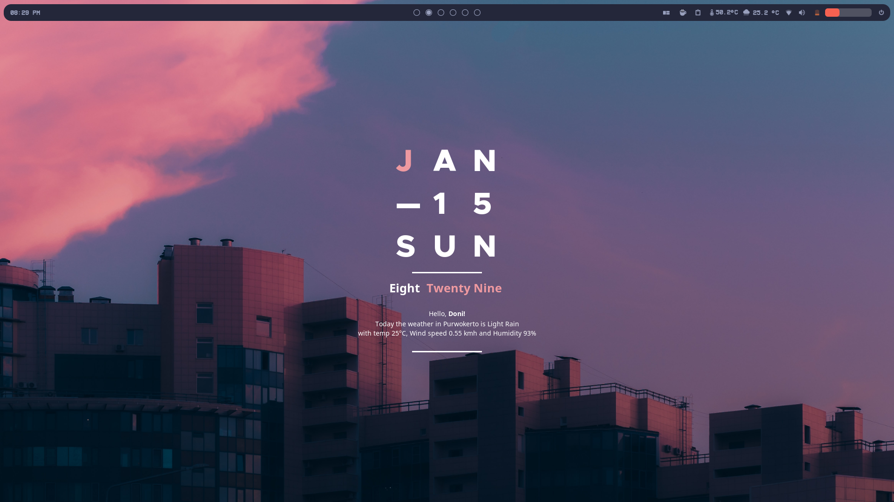
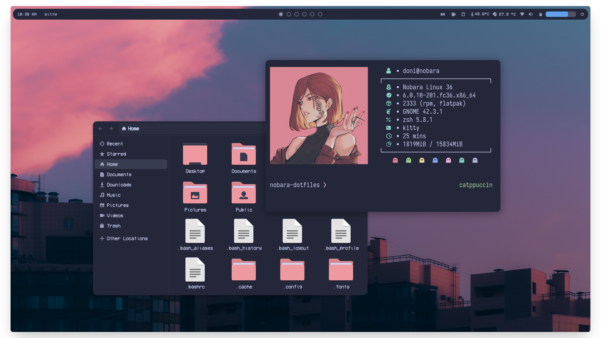
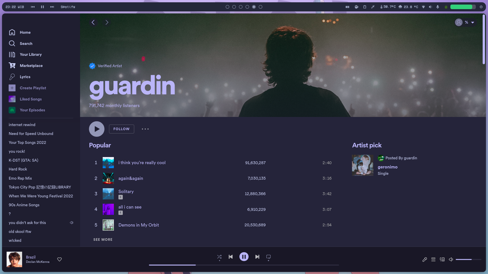
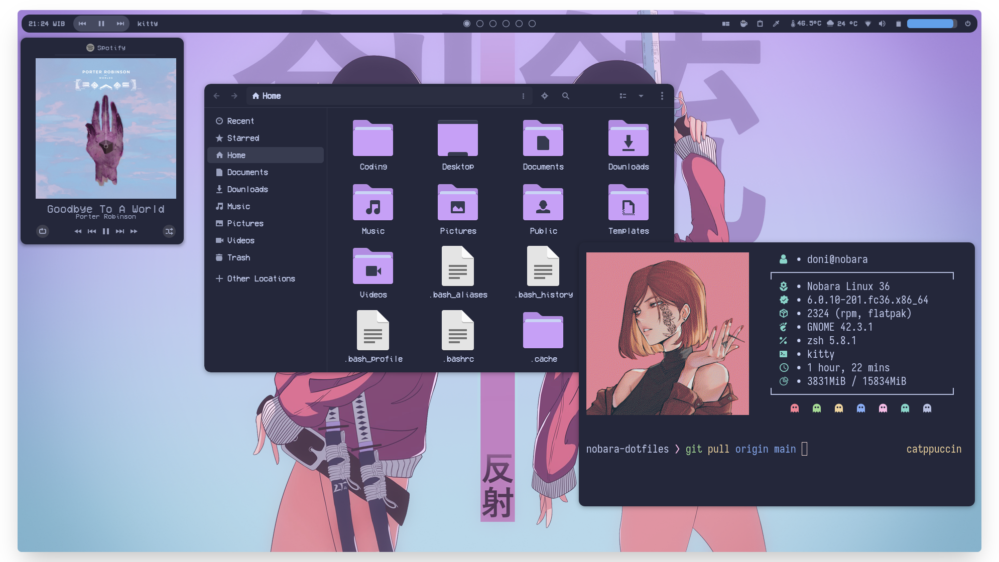
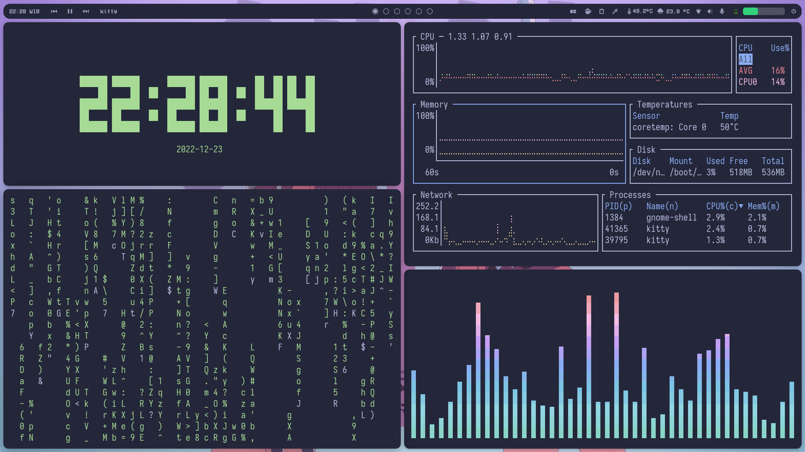
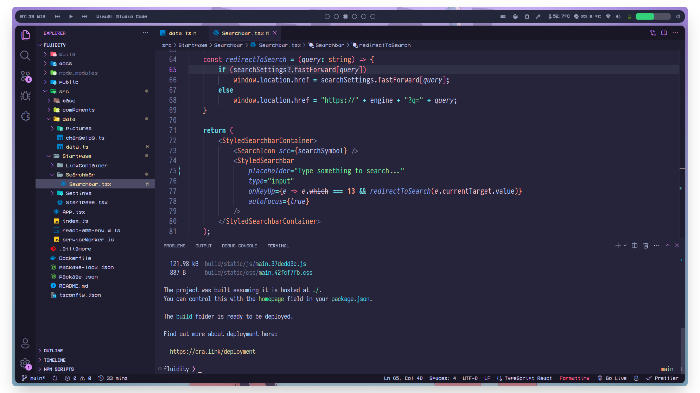

<h3 align="center">
	<br/>
	
	<samp>~/.nobara-dotfiles</samp>
	
</h3>

<!---
<h6 align="center">
  <a href="https://github.com/slashedzer0/nobara-dotfiles#-screenshots">Screenshots</a>
  •
  <a href="https://github.com/slashedzer0/nobara-dotfiles#%E2%84%B9%EF%B8%8F-important-notes">Notes</a>
  •
  <a href="https://github.com/slashedzer0/nobara-dotfiles#-terminal-setup">Setups</a>
  •
  <a href="https://github.com/slashedzer0/nobara-dotfiles#-extensions">Extensions</a>
  •
  <a href="https://github.com/slashedzer0/nobara-dotfiles#-more">References</a>
</h6>
--->

<p align="center">
  
</p>

<p align="center">
  
  
  
  
</p>

<p align="center">
Inspired by the Catppuccin color scheme. Still a lot of work to do...
</p>

<details open>
<summary><h3><samp>🌸 Screenshots</samp></h3></summary>













</details>

<details open>
<summary><h3><samp>ℹ️ Important Notes</samp></h3></summary>

- The rice is done on GNOME v42.x and probably will not work on older version. Some of the extensions are comes pre-installed (\*) from Nobara 36, which is the OS I use.
- You can remove titlebar buttons to achieve more minimalism:

```bash
# Don't forget to set some keyboard shortcuts before applying
gsettings set org.gnome.desktop.wm.preferences button-layout :
```

- To load extensions settings, install the extensions first then run commands below:

```bash
# Assuming you are already in this dotfiles directory
cd preset
dconf load /org/gnome/shell/extensions/ < extensions.conf
```

- There is a [`stylesheet.css`](https://github.com/slashedzer0/nobara-dotfiles/tree/catppuccin/preset/dash-to-dock@micxgx.gmail.com) from [dash-to-dock](https://github.com/micheleg/dash-to-dock) that I tweaked a bit to make the gaps more consistent. You can use it by running:

```bash
# Assuming you are already in 'preset' directory (make backup first!)
cd dash-to-dock@micxgx.gmail.com
cp stylesheet.css ~/.local/share/gnome-shell/extensions/dash-to-dock@micxgx.gmail.com/

# Or if your OS comes with dash-to-dock extension by default (root access needed)
sudo cp stylesheet.css /usr/local/share/gnome-shell/extensions/dash-to-dock@micxgx.gmail.com/
```

- The top panel is based on [Catppuccin GTK](https://github.com/catppuccin/gtk). I simply modified some lines in `gnome-shell.css` for little improvements.
- I also modified `config.conf` from [neofetch-themes](https://github.com/chick2d/neofetch-themes/blob/main/normal/idlifetch.conf).
</details>

<details>
<summary><h3><samp>👾 Terminal Setup</samp></h3></summary>

- Emulator: [kitty](https://github.com/kovidgoyal/kitty)
- Shell: [zsh](https://github.com/zsh-users/zsh)
- Framework: [Zinit](https://github.com/zdharma-continuum/zinit)
- Prompt: [common](https://github.com/jackharrisonsherlock/common)
</details>

<details>
<summary><h3><samp>🎨 Desktop Setup</samp></h3></summary>

- Theme: [Catppuccin GTK](https://github.com/catppuccin/gtk)
- Icons: [Papirus](https://github.com/PapirusDevelopmentTeam/papirus-icon-theme) + [papirus-folders](https://github.com/catppuccin/papirus-folders)
- Fonts: [VCR OSD Mono](https://www.dafont.com/vcr-osd-mono.font), [Iosevka NF](https://github.com/ryanoasis/nerd-fonts/tree/master/patched-fonts/Iosevka)
- Cursor: [macOS Monterey](https://github.com/ful1e5/apple_cursor)
- Widget: [Pleione](https://www.pling.com/p/1832702/)
</details>

<details>
<summary><h3><samp>🧩 Extensions</samp></h3></summary>

- [Alphabetical App Grid](https://extensions.gnome.org/extension/4269/alphabetical-app-grid/)
- [AppIndicator and KStatusNotifierItem Support](https://extensions.gnome.org/extension/615/appindicator-support/)
- [Applications Menu](https://extensions.gnome.org/extension/6/applications-menu/)
- [Auto Move Windows](https://extensions.gnome.org/extension/16/auto-move-windows/)\*
- [Aylur’s Widgets](https://extensions.gnome.org/extension/5338/aylurs-widgets/)
- [Blur my Shell](https://extensions.gnome.org/extension/3193/blur-my-shell/)\*
- [Caffeine](https://extensions.gnome.org/extension/517/caffeine/)\*
- [Clipboard History](https://extensions.gnome.org/extension/4839/clipboard-history/)\*
- [Colored AppMenu Icon](https://extensions.gnome.org/extension/3712/color-app-menu-icon/)
- [Compiz alike magic lamp effect](https://extensions.gnome.org/extension/3740/compiz-alike-magic-lamp-effect/)
- [Compiz Windows Effect](https://extensions.gnome.org/extension/3210/compiz-windows-effect/)
- [Dask to Dock](https://extensions.gnome.org/extension/307/dash-to-dock/)\*
- [GSConnect](https://extensions.gnome.org/extension/1319/gsconnect/)\*
- [Just Perfection](https://extensions.gnome.org/extension/3843/just-perfection/)\*
- [Media Controls](https://extensions.gnome.org/extension/4470/media-controls/)
- [OpenWeather](https://extensions.gnome.org/extension/750/openweather/)\*
- [[QSTweak] Quick Setting Tweaker](https://extensions.gnome.org/extension/5446/quick-settings-tweaker/)
- [Rounded Window Corners](https://extensions.gnome.org/extension/5237/rounded-window-corners/)
- [Running Apps List](https://extensions.gnome.org/extension/5832/running-apps-list/)
- [User Themes](https://extensions.gnome.org/extension/19/user-themes/)
- [Vitals](https://extensions.gnome.org/extension/1460/vitals/)
- [Wireless HID](https://extensions.gnome.org/extension/4228/wireless-hid/)


- [Application Volume Mixer](https://extensions.gnome.org/extension/3499/application-volume-mixer/)\*
- [Custom Accent Colors](https://extensions.gnome.org/extension/5547/custom-accent-colors/)
- [Gesture Improvements](https://extensions.gnome.org/extension/4245/gesture-improvements/)\*
- [Pop Shell](https://github.com/pop-os/shell)\*


</details>

<details>
<summary><h3><samp>⚡ Terminal Apps</samp></h3></summary>

- [neofetch](https://github.com/dylanaraps/neofetch) - fetch system info
- [cava](https://github.com/karlstav/cava) - audio visualizer
- [tty-clock](https://github.com/xorg62/tty-clock)
- [bottom](https://github.com/ClementTsang/bottom) / [htop](https://github.com/htop-dev/htop) - system monitor
- [pokemon-colorscripts](https://gitlab.com/phoneybadger/pokemon-colorscripts)
- [colorscript](https://gitlab.com/dwt1/shell-color-scripts)
- [tldr](https://github.com/tldr-pages/tldr) - a terminal companion
- [taskwarrior](https://github.com/GothenburgBitFactory/taskwarrior) - task management
- [yt-dlp](https://github.com/yt-dlp/yt-dlp)
- [nbfc-linux](https://github.com/nbfc-linux/nbfc-linux) - fan control
- [duf](https://github.com/muesli/duf) / [ncdu](https://dev.yorhel.nl/ncdu) - disk usage analyzer
</details>

<details>
<summary><h3><samp>🍬 More…</samp></h3></summary>

- [Catppuccin for VS Code](https://github.com/catppuccin/vscode)
- [Catppuccin for JetBrains](https://github.com/catppuccin/jetbrains)
- [Catppuccin for Discord](https://github.com/catppuccin/discord)
- [Catppuccin for Spicetify](https://github.com/catppuccin/spicetify)
- [Catppuccin for Firefox](https://github.com/catppuccin/firefox)
- [Catppuccin for Chrome](https://github.com/catppuccin/chrome)
- [My custom startpage](https://github.com/slashedzer0/Ether)
</details>

<details open>
<summary><h3><samp>💫 Credits</samp></h3></summary>

- Catppuccin
- micheleg
- Chick2D / IdliDev
- closebox73
- Wallhaven
</details>

<p align="center"></p>
