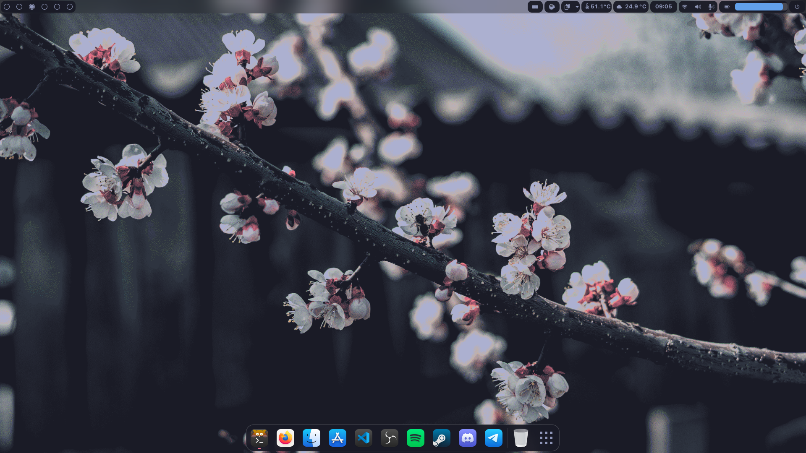

<h1 align="center">~/.dotfiles</h1>

### ℹ️ Important Notes

- The rice is done on GNOME v42.x and probably will not work on other version. Some of the extensions are comes pre-installed (*) from Nobara 36, which is the OS I use.
- You can remove the titlebar buttons to achieve more minimalism:

```bash
# Don't forget to set some keyboard shortcuts before applying
gsettings set org.gnome.desktop.wm.preferences button-layout :
```

- To load extensions settings, install the extensions first then run:

```bash
# Assuming you are already in this dotfiles directory
cd preset
dconf load /org/gnome/shell/extensions/ < extensions-settings.conf
```

- The top panel is based on [Tokyo Night GTK](https://www.gnome-look.org/p/1681470). I simply modified some lines in `gnome-shell.css` for little improvements.
- For the startpage, I use  [_traichu](https://github.com/Tressley/_traichu) and edited the background color in `styles.css` to match the Tokyo Night color scheme.
- I also modified the neofetch config from [neofetch-themes](https://github.com/chick2d/neofetch-themes/blob/main/normal/idlifetch.conf).

### 🌸 Gallery




### 👾 Terminal Setup

- Emulator: [kitty](https://github.com/kovidgoyal/kitty)
- Shell: [zsh](https://archlinux.org/packages/extra/x86_64/zsh/)
- Framework: [Zinit](https://github.com/zdharma-continuum/zinit)
- Prompt: [common](https://github.com/jackharrisonsherlock/common)

### 🎨 Desktop Setup

- Theme: [Tokyo Night GTK](https://github.com/Fausto-Korpsvart/Tokyo-Night-GTK-Theme) (dark/borderless)
- Icons: [WhiteSur](https://github.com/vinceliuice/WhiteSur-icon-theme) (bold)
- Fonts: [SF Pro Display](https://github.com/sahibjotsaggu/San-Francisco-Pro-Fonts), [Iosevka NF](https://github.com/ryanoasis/nerd-fonts/tree/master/patched-fonts/Iosevka)
- Cursor: [macOS Monterey](https://github.com/ful1e5/apple_cursor)

### 🧩 Extensions

- [User Themes](https://extensions.gnome.org/extension/19/user-themes/)
- [Dask to Dock](https://extensions.gnome.org/extension/307/dash-to-dock/)*
- [Blur my Shell](https://extensions.gnome.org/extension/3193/blur-my-shell/)*
- [Aylur’s Widgets](https://extensions.gnome.org/extension/5338/aylurs-widgets/)
- [Rounded Widow Corners](https://extensions.gnome.org/extension/5237/rounded-window-corners/)
- [Just Perfection](https://extensions.gnome.org/extension/3843/just-perfection/)*
- [Pop Shell](https://github.com/pop-os/shell)*
- [Application Volume Mixer](https://extensions.gnome.org/extension/3499/application-volume-mixer/)*
- [Auto Move Windows](https://extensions.gnome.org/extension/16/auto-move-windows/)*
- [Media Controls](https://extensions.gnome.org/extension/4470/media-controls/)
- [Caffeine](https://extensions.gnome.org/extension/517/caffeine/)*
- [GSConnect](https://extensions.gnome.org/extension/1319/gsconnect/)*
- [OpenWeather](https://extensions.gnome.org/extension/750/openweather/)*
- [Gesture Improvements](https://extensions.gnome.org/extension/4245/gesture-improvements/)*
- [Clipboard History](https://extensions.gnome.org/extension/4839/clipboard-history/)*
- [Compiz alike magic lamp effect](https://extensions.gnome.org/extension/3740/compiz-alike-magic-lamp-effect/)
- [Vitals](https://extensions.gnome.org/extension/1460/vitals/)

### ⚡ Terminal Apps

- [neofetch](https://github.com/dylanaraps/neofetch) - fetch operating system info
- [cava](https://github.com/karlstav/cava) - audio visualizer
- [tty-clock](https://github.com/xorg62/tty-clock)
- [bottom](https://github.com/ClementTsang/bottom) / [htop](https://github.com/htop-dev/htop) - system monitor
- [pokemon-colorscripts](https://gitlab.com/phoneybadger/pokemon-colorscripts)
- [colorscript](https://gitlab.com/dwt1/shell-color-scripts)
- [tldr](https://github.com/tldr-pages/tldr) - too long; didn’t read

### 💫 Credits

- Fausto-Korpsvart
- Tressley
- Chick2D / IdliDev
- Gogh-Co

### 🍬 More…

- [Tokyo Night for VS Code](https://github.com/enkia/tokyo-night-vscode-theme)
- [Tokyo Night for SDDM](https://github.com/rototrash/tokyo-night-sddm)
- [Tokyo Night for Spicetify](https://github.com/actualdankcoder/TokyoNight-spicetify)
- [Tokyo Night for BetterDiscord](https://github.com/Dyzean/Tokyo-Night)
- [distro-grub-themes](https://github.com/AdisonCavani/distro-grub-themes)
- [r/startpages](https://www.reddit.com/r/startpages/)
- [Gogh](https://github.com/Gogh-Co/Gogh)
